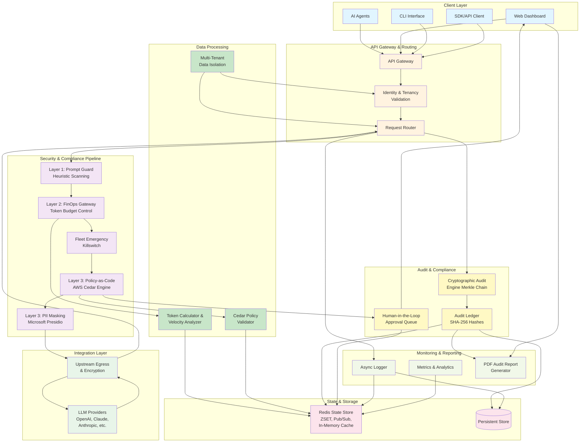

# AEGISCLAW: Technical Architecture & Implementation Details

This document outlines the complete technical implementation of the AegisClaw platform. It serves as a permanent reference for the architecture, data flows, and security mechanics that power the World's First Unified AI Control Plane.

---

## Architecture Overview

AegisClaw is the world's first unified AI control plane, providing centralized orchestration and management of AI systems with enterprise-grade security and compliance.

---

## 1. System Topology

AegisClaw operates as an **inline, multi-tenant network proxy**. It intercepts API traffic between a company's internal AI fleet and external LLM providers (e.g., OpenAI, Anthropic), executing a 7-Gate security pipeline.

### Technology Stack
- **Frontend:** Next.js (React), TailwindCSS. Deployed on Railway.
- **Backend Core:** FastAPI (Python), Uvicorn. Deployed on Railway.
- **State & In-Memory Datastore:** Redis.
- **Policy Engine:** AWS Cedar (Policy-as-Code).
- **PII Redaction Engine:** Microsoft Presidio (NLP Contextual Scanning).

---

## 2. Multi-Tenant Data Isolation (Phase 1 Auth)

AegisClaw is built on a strict multi-tenant architecture to ensure enterprise data isolation:
- **Tenant IDs:** Every customer receives a unique cryptographic `tenant_id` upon registration (handled via bcrypt hashing).
- **Zero-Friction API Keys:** The customer generates a single API Key bound permanently to their `tenant_id`. 
- **Header-Based Routing:** The customer's AI agents append `x-compliance-region: [US|EU|IN]` to their requests. AegisClaw dynamically loads the specific regional security profile while remaining compliant with local data residency laws.
- **Admin Dashboard Auth:** The frontend dashboard relies on a secure JWT `Authorization` header to fetch logs, ensuring a CISO can only see their own company's intercepted traffic.

---

## 3. The 7-Gate Proxy Pipeline (Data Path)

When an AI agent makes a request to `https://justambition.up.railway.app/proxy/...`, the request passes through a synchronous pipeline of asynchronous validators:

### Gate 1: Identity & Tenancy Validation
- Extracts the API Key from the `Authorization` header.
- Resolves the Key to the isolated `tenant_id`.

### Gate 2: Layer 1 Prompt Guard (Heuristic Scanning)
- Parses the JSON payload.
- Scans against known jailbreak vectors (e.g., "ignore previous instructions").
- Immediately blocks malicious injection attempts (Status: `403 Forbidden`).

### Gate 3: Layer 2 FinOps Gateway (Token & Velocity Routing)
- Calculates a heuristic token estimate of the payload.
- Uses **Redis Sorted Sets (ZSET)** to evaluate a sliding 24-hour token budget limit.
- Blocks requests exceeding daily token allowances (Status: `429 Too Many Requests`).

### Gate 4: Fleet Emergency Killswitch
- Queries Redis to check if the CISO engaged the global killswitch.
- If active, hard-halts all traffic instantly across the entire tenant fleet.

### Gate 5: Layer 3 Policy-as-Code (AWS Cedar)
- Maps the inbound HTTP request (e.g., `/api/v1/payments/refund`) to an Action (`execute_refund`).
- Extracts the requested financial amount from the `x-requested-amount` header.
- Evaluates the payload mathematically using the region's Cedar Policy (e.g., `us_hipaa_nist.cedar`).
- **HITL Integration:** If an action violates a soft limit, it is pushed to a Redis Pub/Sub queue for Human-in-the-Loop approval on the CISO Dashboard.

### Gate 6: Layer 3 Contextual PII Masking (Presidio)
- Uses NLP to identify sensitive data inside the payload context.
- **Dynamic Routing:** If the header is `US`, it targets SSNs and HIPAA PHI. If `IN`, it targets Aadhaar and DPDP data.
- Strips and masks the data in memory.

### Gate 7: Upstream Egress & Audit Hashing
- The heavily sanitized payload is transmitted securely to the target host (e.g., OpenAI).
- The response is streamed back to the AI Agent.
- The latency, payload hashes, and decision trees are logged asynchronously into a Redis list (`audit_ledger`).

---

## 4. Cryptographic Audit Engine (The Merkle Chain)

To satisfy EU AI Act Article 12 (10-year record retention) and NIST standards, AegisClaw generates tamper-evident logs.
- Every transaction log is hashed using **SHA-256**.
- Each new log contains the cryptographic hash of the *previous* log, creating an unbroken Merkle chain.
- The CISO Dashboard's **"PDF AUDIT"** feature extracts this chain from Redis and compiles it into a downloadable, immutable PDF report.

---

## 5. Directory Structure & Key Files

- `frontend/src/app/dashboard/page.tsx`: The Unified Global Command Center UI.
- `backend/app/main.py`: The core FastAPI proxy routing and 7-Gate pipeline logic.
- `backend/app/policy_engine.py`: Integration with the AWS Cedar AST evaluator.
- `backend/app/gateway_engine.py`: Redis ZSET FinOps budget logic.
- `backend/app/pii_engine.py`: Microsoft Presidio redaction mappings.
- `backend/policies/*.cedar`: Declarative Policy-as-Code rules for US, EU, and IN markets.

---

*Built for the enterprise. Governed by math. Secured at the network layer.*
